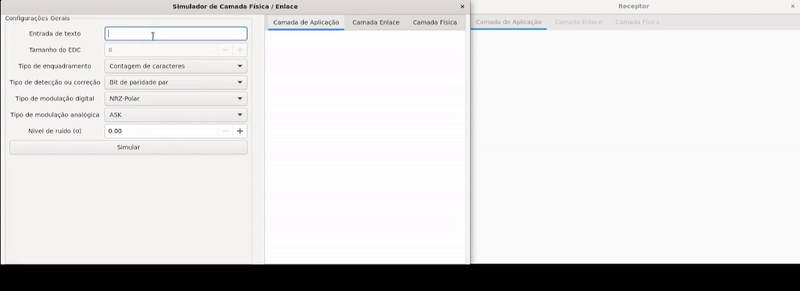

<h1 align="center">Physical-DataLink-Sim</h1>

<p align="center">
  <em>Didactic simulator to experiment with framing, error control (EDC) and digital/carrier modulations (with a GTK UI)</em>
</p>

<p align="center">
  <a href="#">
    
  </a>
  <a href="#">
    
  </a>
  <a href="#">
    
  </a>
  <a href="#">
    
  </a>
</p>

---

## Overview

**Physical-DataLink-Sim** integrates, in a transmitter–receiver flow, key techniques from the **Physical** and **Data Link** layers. The **GTK** GUI lets you pick parameters (modulation, framing, EDC, noise) and visualize **bits, frames** and **signals**.

**Includes**
- **Baseband (digital) line coding:** NRZ-Polar, Manchester, Bipolar (AMI)  
- **Carrier modulation:** ASK, FSK, 8-QAM  
- **Framing:** character count, byte-stuffing, bit-stuffing (FLAGS)  
- **EDC:** even parity, **CRC-8**, **Hamming (7, 4)** (error detection/correction)  
- **Noise:** Gaussian on the analog signal + equivalent noise mapping to digital levels

---

## Demo

<p align="center">
  
</p>
<p align="center"><i>Gaussian noise injection with Hamming and even-parity checks</i></p>

---

<p align="center">
  
</p>
<p align="center"><i>NRZ / Manchester / Bipolar and ASK / FSK / 8-QAM</i></p>

---

<p align="center">
  
</p>
<p align="center"><i>Frames + Parity/CRC-8/Hamming with visualization</i></p>

---

## Academic Context

**University:** Universidade de Brasília (UnB)  
**Institute/Department:** Instituto de Exatas (IE) - Departamento de Ciência da Computação (CIC)  
**Course:** CIC0235 - Teleinformatics & Computer Networks I (1/2025)  
**Project:** Final Assignment - Group G7 - *“Simulador das Camadas Física e de Enlace”*  
**Team:**  
- Rodrigo Fonseca Torreao (211066196)  
- Arthur Delpino Barbabella (221002094)  
- João Victor Cavallin Pereira (212008894)

---

## Features

- **Parallel TX/RX** via threads with message passing using `queue.Queue`
- **TCP socket** (local **port 711**) to transfer frames and signals
- **GTK GUI** with tabs per layer: Application, Data Link, Physical
- **Signal plots** (Matplotlib) updated during the pipeline
- **Packet serialization** using `pickle` (parameters + analog/digital signals)
- **Noise injection**: Gaussian on analog + per-bit averaged noise on digital

---

## Architecture & Flow

**Transmitter**
- **Application:** converts text to bytes/bits and shows original/bitstream  
- **Data Link:** applies selected **framing** and **EDC** (Parity/CRC/Hamming)  
- **Physical:** applies selected **baseband coding** (NRZ-Polar, Bipolar, Manchester) and **carrier modulation** (ASK, FSK, 8-QAM)  
- Updates GUI and sends a serialized **message dict** via TCP (**port 711**)

**Receiver**
- Receives and **deserializes** the message (pickle → dict with parameters/signals)  
- Displays **analog signal** (with added noise)  
- Displays **digital signal** (e.g., NRZ, Manchester)  
- **Deframes** and **verifies EDC** (Parity/CRC/Hamming), reporting status/corrections  
- Updates GUI with intermediate frames, signals and messages

**GUI (GTK)**
- **Input queue** (structured data to display) and **output queue** (simulation parameters: message, modulation, noise level, etc.)  
- Tabs per layer to show **original/decoded data**, **frames** and **plots**

---

## Technologies

- **Python 3.10+**
- **GTK 3 (PyGObject)** for the GUI
- **NumPy** (signals/noise), **Matplotlib** (plots)
- **sockets**, **threading**, **pickle** (stdlib)

---

## How to Run (Linux)

> Minimal setup on Debian/Ubuntu (WSL works too)

**1) System deps (APT)**
```bash
sudo apt update && sudo apt install -y \
  python3-venv python3-pip \
  python3-gi python3-gi-cairo gir1.2-gtk-3.0
```

## 2) Python env + deps
```bash
python3 -m venv .venv --system-site-packages
source .venv/bin/activate
pip install -r requirements.txt
```

## 3) Run
```bash
python3 -m src.Simulador
```